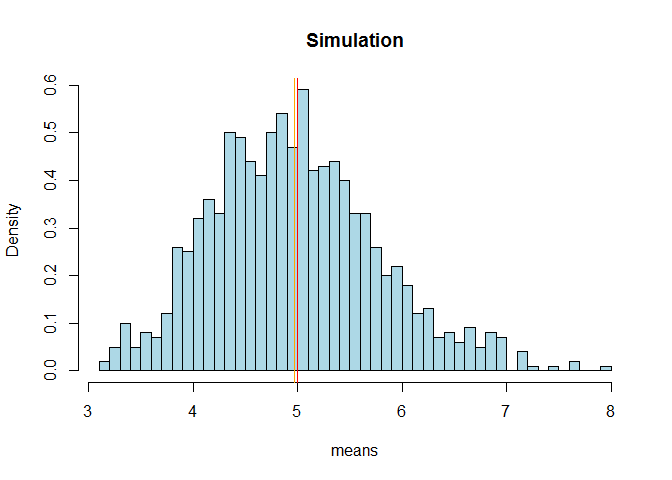
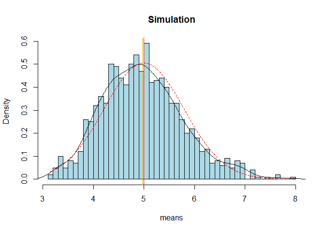
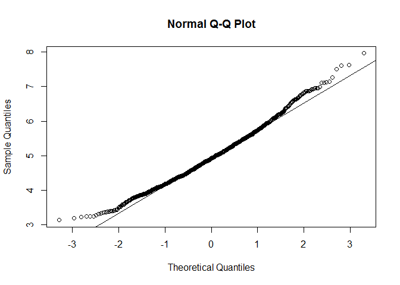

# Statistical Inference: Course Project
Lampros Fxxxxxxx  

## OVERVIEW
In this project we will examine the distribution of 1000 averages of 40 exponential distributions.
We will calculate the sample mean and compare with the equivalent theoretical mean of the distribution.
We will show the sample variance and compare with the theoretical variance of the distribution.
Finally, we will compare the sample distribution with the normal.

# SIMULATION

* Load libraries and set the simulation parameters
----

* Create a matrix with the needed number of simulations and parameters and calculate the means

# Sample Mean versus Theoretical Mean

* Calculate the mean of the simulated distribution and the theoretical center of the distribution

* We plot the histogram, along with a red line for the theoretical mean and orange line for the simulated(sample) mean.

 

In the above histogram we can see the distribution of 1000 averages of 40 random exponential.

The **sample** mean is *4.9722707*  while the **theoretical** mean is *5*; as we can see they are very close, and almost indistinguishable in the plot. This is what was expected in accordance with the Central Limit Theorem.

# Sample Variance versus Theoretical Variance

* Calculate the sample and theoretical standard deviations

The theoretical standard deviation is :$\frac{\frac{1}{lamda}}{\sqrt(n)}$

We calculate the theoretical and sample standard deviations below:

The results are:  
Theoretical SD : 0.7905694  
Sample SD : 0.7956291

The variance is the square of the standard deviation:  

The results are: 
Theoretical variance: 0.625  
Sample variance: 0.6330257  

* Plot the theoretical distribution in comparison with the simulated results.

 

We can see how similar the simulated distribution of means is, compared to the corresponding normal distribution, which is supported by the Central Limit Theorem.

# Distribution

Although we can visually see above that the distribution is approximately normal, we can examine the distribution normality by a Q-Q plot

 

From the above plot, we can see how close the simulated values are to the normal distribution values.
