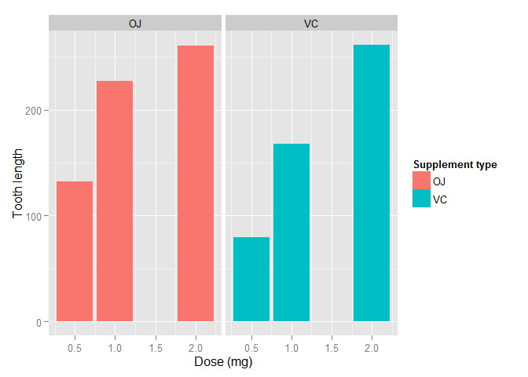

# Statistical Inference: Course Project Part2
Lampros Fxxxxxxx  


In this part of the project we analyze the ToothGrowth data in the R datasets package.

# LOAD THE TOOTHGROW DATA


* Load libraries

```r
if (!require("ggplot2")) install.packages("ggplot2")
library(datasets)
toothdata <- ToothGrowth
```

* Convert dose to factor
toothdata$dose <- as.factor(toothdata$dose)


# PROVIDE A BASIC SUMMARY OF THE DATA AND PERFORM BASIC EXPLORATORY ANALYSIS

* Create the plot


```r
ggplot(data=toothdata, aes(x=dose, y=len, fill=supp)) + geom_bar(stat="identity",) + facet_grid(. ~supp) + xlab("Dose (mg)") + ylab("Tooth length") + guides(fill=guide_legend(title="Supplement type"))
```

 

We can see at the above bars that there is a positive correlation between the tooth length and the dose of vitamin C in both OJ and VC delivery methods.
It seems that in the smaller dosages of 0.5mg and 1mg the orange juice helps the tooth growth more than the pure ascorbic acid, while it is almost equal at the 2mg dosage. To support the above we will continue to T-test analysis.

# COMPARE TOOTH GROWTH BY SUPP AND DOSE, USING CONFIDENCE INTERVALS AND/OR HYPOTHESIS TESTS

* Compare at 0.5mg dose 

```r
t.test(len~supp, toothdata[toothdata$dose ==0.5,])
```

```
## 
## 	Welch Two Sample t-test
## 
## data:  len by supp
## t = 3.1697, df = 14.969, p-value = 0.006359
## alternative hypothesis: true difference in means is not equal to 0
## 95 percent confidence interval:
##  1.719057 8.780943
## sample estimates:
## mean in group OJ mean in group VC 
##            13.23             7.98
```
* Compare at 1mg dose

```r
t.test (len~supp, toothdata[toothdata$dose ==1,])
```

```
## 
## 	Welch Two Sample t-test
## 
## data:  len by supp
## t = 4.0328, df = 15.358, p-value = 0.001038
## alternative hypothesis: true difference in means is not equal to 0
## 95 percent confidence interval:
##  2.802148 9.057852
## sample estimates:
## mean in group OJ mean in group VC 
##            22.70            16.77
```

* Compare at  2mg dose

```r
t.test (len~supp, toothdata[toothdata$dose ==2,])
```

```
## 
## 	Welch Two Sample t-test
## 
## data:  len by supp
## t = -0.046136, df = 14.04, p-value = 0.9639
## alternative hypothesis: true difference in means is not equal to 0
## 95 percent confidence interval:
##  -3.79807  3.63807
## sample estimates:
## mean in group OJ mean in group VC 
##            26.06            26.14
```

For all the three comparisons the confidence intervals do not contain the zero (0). The p-value for 0.5mg and 1mg doses, is significantly smaller than 0.05, but the p-value for 2mg dose is more than 0.05.
Therefore we can conclude safely that for doses of 0.5mg and 1mg the orange juice is more effective as a tooth growth agent than ascorbic acid, with a 95% confidence interval.
For the 2mg we can not safely make any conclusions, in a 95% confidence interval.

# STATE THE CONCLUSIONS AND ASSUMPTIONS
We performed exploratory analysis of the tooth length growth correlation to Orange Juice (OJ) and ascorbic acid (VC).
It is obvious that there is a strong possitive correlation of the tooth length growth and vitamin C delivery.

We performed also hypothesis analysis with the following assumptions:

* Random guinea pigs to Vitamin C delivery
* Correct sample of guinea pigs in accordance with the general population
* Sufficient difference in variance between the two groups of delivery methods (OJ and VC)

The hypothesis analysis concluded that in small doses (0.5mg and 1mg) the Orange Juice is more effective delivery method of Vitamin C in tooth growth.
